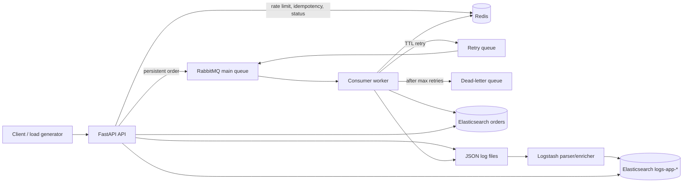

# Production Backend Lab

[Tiếng Việt](README.vi.md) | English

A runnable order-processing lab for backend and SRE practice. It demonstrates synchronous REST handling, asynchronous durable work, retries and dead letters, Redis state, Elasticsearch business search, and parsed centralized JSON logs.

## Architecture



## Services

| Service | Light-mode address | Credentials / purpose |
|---|---|---|
| API | http://localhost:8000/docs | REST API and Swagger UI |
| RabbitMQ AMQP | localhost:5672 | `lab` / `lab` |
| RabbitMQ UI | http://localhost:15672 | `lab` / `lab` |
| Redis | localhost:6379 | no password, lab only |
| Elasticsearch | http://localhost:9200 | security disabled, lab only |
| Kibana | http://localhost:5601 | optional `ui` profile |

## Quick Start: Light Mode

Requires Docker Compose and roughly 3-4 GB free RAM.

```bash
cp .env.example .env
make up
make bootstrap
curl http://localhost:8000/ready
make test-normal
make test-idempotency
make test-rate-limit
make test-dlq
make test-log-trace
```

Published ports can be changed in `.env` when another local stack already uses a default, for example `ELASTICSEARCH_PORT=19200`. Container-to-container addresses do not change.

`make bootstrap` installs explicit Elasticsearch templates and creates `orders`. RabbitMQ exchanges and queues are declared idempotently by the API and consumer at startup.

Enable Kibana only when needed:

```bash
docker compose --profile ui up -d kibana
```

## Full Mode

Full mode is a separate stack with three RabbitMQ nodes, classic peer discovery, quorum queues, and HAProxy at `localhost:5672`. It also starts a Redis replica and Sentinel. The applications intentionally use the Redis primary directly so students can observe why Sentinel-aware clients are required for automatic failover. Elasticsearch stays single-node to keep RAM use reasonable; a real three-node Elasticsearch cluster generally requires considerably more than an 8 GB laptop.

```bash
make down
make up-full
docker compose -f docker-compose.full.yml --profile tools run --rm es-init
docker compose -f docker-compose.full.yml exec rabbitmq1 rabbitmqctl cluster_status
docker compose -f docker-compose.full.yml exec rabbitmq1 rabbitmqctl list_queues name type online
```

Stopping one RabbitMQ node leaves a two-node quorum majority:

```bash
make chaos-stop-rabbit-node
curl -X POST http://localhost:8000/orders -H 'Content-Type: application/json' \
  -d '{"client_id":"full-test","message":"quorum survives","amount":10}'
make chaos-start-rabbit-node
```

## API and End-to-End Flow

Create an order:

```bash
curl -i -X POST http://localhost:8000/orders \
  -H 'Content-Type: application/json' \
  -H 'Idempotency-Key: course-demo-1' \
  -H 'X-Trace-ID: trace-course-demo' \
  -d '{"client_id":"student-1","message":"first order","amount":42.50}'
```

The API increments `rate:<client>:<minute>`, checks `idempotency:<key>`, publishes a persistent message, and stores `job:<order_id>`. The worker manually acknowledges only after processing or safely republishing. Failures go to a TTL retry queue and return to the main queue; after `MAX_RETRIES`, they enter `orders.dlq`.

Useful endpoints:

```bash
curl http://localhost:8000/orders/ORDER_ID
curl 'http://localhost:8000/search?q=first'
curl 'http://localhost:8000/logs/search?request_id=REQUEST_ID'
curl 'http://localhost:8000/logs/search?trace_id=TRACE_ID'
curl http://localhost:8000/health
curl http://localhost:8000/ready
```

## Inspection

RabbitMQ UI shows exchanges, bindings, publish rates, ready messages, unacknowledged messages, and the DLQ. CLI equivalents:

```bash
docker compose exec rabbitmq rabbitmqctl list_queues name type messages_ready messages_unacknowledged
docker compose exec rabbitmq rabbitmqctl list_exchanges name type durable
```

Redis:

```bash
docker compose exec redis redis-cli --scan --pattern 'idempotency:*'
docker compose exec redis redis-cli --scan --pattern 'rate:*'
docker compose exec redis redis-cli --scan --pattern 'job:*'
docker compose exec redis redis-cli TTL idempotency:YOUR_KEY
docker compose exec redis redis-cli GET job:ORDER_ID
```

Elasticsearch:

```bash
curl 'localhost:9200/orders/_search?pretty'
curl 'localhost:9200/logs-app-*/_search?pretty'
curl -H 'Content-Type: application/json' 'localhost:9200/logs-app-*/_search?pretty' \
  -d '{"query":{"term":{"trace_id":"TRACE_ID"}},"sort":[{"timestamp":"asc"}]}'
```

## Failure Exercises

| Scenario | Command | Observe | Recovery / expected result |
|---|---|---|---|
| Consumer stopped | `make chaos-stop-consumer && docker compose --profile tools run --rm client backlog` | `orders.main.q` ready count rises | `make chaos-start-consumer`; count drains |
| Rabbit node stopped, full mode | `make chaos-stop-rabbit-node` | quorum remains available with 2/3 nodes | `make chaos-start-rabbit-node` |
| Redis stopped | `make chaos-stop-redis` | `/ready` returns 503; creates fail | `make chaos-start-redis` |
| Elasticsearch stopped | `make chaos-stop-elasticsearch` | `/ready` returns 503; worker retries then DLQs if outage persists | `make chaos-start-elasticsearch` |
| Poison order | `make test-dlq` | retry logs, then `orders.dlq` count rises | purge DLQ in UI after inspection |

## Troubleshooting

Run `make ps` and `make logs` first. Elasticsearch startup failure commonly means insufficient memory or Linux `vm.max_map_count`; set it to at least `262144`. Queue declaration errors after changing classic/quorum mode mean an old volume contains incompatible queues: use `make clean` before switching modes. Log search is asynchronous; allow Logstash several seconds to ingest files. `make clean` deletes all lab data.

## Study Questions

1. Why must the worker acknowledge only after durable side effects or a durable retry publish?
2. What duplicate-processing window remains between Elasticsearch indexing and RabbitMQ acknowledgement?
3. Why does a three-node quorum queue tolerate only one failed node?
4. Why is direct-primary Redis configuration insufficient for Sentinel failover?
5. What changes are required before exposing RabbitMQ, Redis, or Elasticsearch outside a private lab network?
