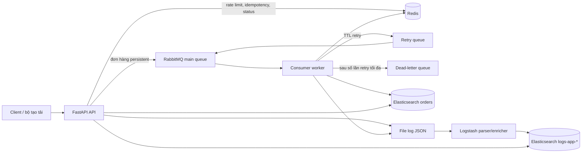

# Production Backend Lab

[English](README.md) | Tiếng Việt

Lab xử lý đơn hàng có thể chạy trực tiếp, phục vụ thực hành backend và SRE. Hệ thống minh họa xử lý REST đồng bộ, công việc bất đồng bộ có tính durable, retry và dead letter, trạng thái Redis, tìm kiếm dữ liệu nghiệp vụ bằng Elasticsearch và log JSON tập trung đã được phân tích.

## Tài liệu chuyên đề

- [Kiến trúc hệ thống](docs/vi/architecture.md)
- [RabbitMQ](docs/vi/rabbitmq.md)
- [Redis](docs/vi/redis.md)
- [Elasticsearch](docs/vi/elasticsearch.md)
- [Luồng xử lý log](docs/vi/log-pipeline.md)
- [Vận hành](docs/vi/operations.md)
- [Xử lý sự cố](docs/vi/troubleshooting.md)

## Kiến trúc



## Dịch vụ

| Dịch vụ | Địa chỉ chế độ light | Thông tin đăng nhập / mục đích |
|---|---|---|
| API | http://localhost:8000/docs | REST API và Swagger UI |
| RabbitMQ AMQP | localhost:5672 | `lab` / `lab` |
| RabbitMQ UI | http://localhost:15672 | `lab` / `lab` |
| Redis | localhost:6379 | không có mật khẩu, chỉ dùng cho lab |
| Elasticsearch | http://localhost:9200 | tắt bảo mật, chỉ dùng cho lab |
| Kibana | http://localhost:5601 | profile `ui` tùy chọn |

## Khởi động nhanh: chế độ light

Yêu cầu Docker Compose và khoảng 3-4 GB RAM trống.

```bash
cp .env.example .env
make up
make bootstrap
curl http://localhost:8000/ready
make test-normal
make test-idempotency
make test-rate-limit
make test-dlq
make test-log-trace
```

Có thể đổi các port được publish trong `.env` nếu một hệ thống khác trên máy đang dùng port mặc định, ví dụ `ELASTICSEARCH_PORT=19200`. Địa chỉ giao tiếp giữa các container không thay đổi.

`make bootstrap` cài đặt các Elasticsearch template tường minh và tạo index `orders`. API và consumer khai báo RabbitMQ exchange và queue theo cách idempotent khi khởi động.

Chỉ bật Kibana khi cần:

```bash
docker compose --profile ui up -d kibana
```

## Chế độ full

Chế độ full là một stack riêng gồm ba node RabbitMQ, cơ chế peer discovery kiểu classic, quorum queue và HAProxy tại `localhost:5672`. Stack này cũng khởi động một Redis replica và Sentinel. Các ứng dụng chủ ý kết nối trực tiếp tới Redis primary để người học quan sát vì sao client hỗ trợ Sentinel là bắt buộc đối với failover tự động. Elasticsearch vẫn chạy một node để giữ mức sử dụng RAM hợp lý; một Elasticsearch cluster ba node thực tế thường cần nhiều hơn đáng kể so với laptop 8 GB RAM.

```bash
make down
make up-full
docker compose -f docker-compose.full.yml --profile tools run --rm es-init
docker compose -f docker-compose.full.yml exec rabbitmq1 rabbitmqctl cluster_status
docker compose -f docker-compose.full.yml exec rabbitmq1 rabbitmqctl list_queues name type online
```

Dừng một node RabbitMQ vẫn giữ được quorum hai node:

```bash
make chaos-stop-rabbit-node
curl -X POST http://localhost:8000/orders -H 'Content-Type: application/json' \
  -d '{"client_id":"full-test","message":"quorum survives","amount":10}'
make chaos-start-rabbit-node
```

## API và luồng end-to-end

Tạo một đơn hàng:

```bash
curl -i -X POST http://localhost:8000/orders \
  -H 'Content-Type: application/json' \
  -H 'Idempotency-Key: course-demo-1' \
  -H 'X-Trace-ID: trace-course-demo' \
  -d '{"client_id":"student-1","message":"first order","amount":42.50}'
```

API tăng `rate:<client>:<minute>`, kiểm tra `idempotency:<key>`, publish một persistent message và lưu `job:<order_id>`. Worker chỉ gửi acknowledgement thủ công sau khi xử lý xong hoặc sau khi republish an toàn. Các lần xử lý thất bại được chuyển tới TTL retry queue rồi quay lại main queue; sau `MAX_RETRIES`, message được đưa vào `orders.dlq`.

Các endpoint hữu ích:

```bash
curl http://localhost:8000/orders/ORDER_ID
curl 'http://localhost:8000/search?q=first'
curl 'http://localhost:8000/logs/search?request_id=REQUEST_ID'
curl 'http://localhost:8000/logs/search?trace_id=TRACE_ID'
curl http://localhost:8000/health
curl http://localhost:8000/ready
```

## Kiểm tra hệ thống

RabbitMQ UI hiển thị exchange, binding, tốc độ publish, message sẵn sàng xử lý, message chưa được acknowledge và DLQ. Các lệnh CLI tương ứng:

```bash
docker compose exec rabbitmq rabbitmqctl list_queues name type messages_ready messages_unacknowledged
docker compose exec rabbitmq rabbitmqctl list_exchanges name type durable
```

Redis:

```bash
docker compose exec redis redis-cli --scan --pattern 'idempotency:*'
docker compose exec redis redis-cli --scan --pattern 'rate:*'
docker compose exec redis redis-cli --scan --pattern 'job:*'
docker compose exec redis redis-cli TTL idempotency:YOUR_KEY
docker compose exec redis redis-cli GET job:ORDER_ID
```

Elasticsearch:

```bash
curl 'localhost:9200/orders/_search?pretty'
curl 'localhost:9200/logs-app-*/_search?pretty'
curl -H 'Content-Type: application/json' 'localhost:9200/logs-app-*/_search?pretty' \
  -d '{"query":{"term":{"trace_id":"TRACE_ID"}},"sort":[{"timestamp":"asc"}]}'
```

## Bài thực hành sự cố

| Kịch bản | Lệnh | Quan sát | Khôi phục / kết quả mong đợi |
|---|---|---|---|
| Consumer bị dừng | `make chaos-stop-consumer && docker compose --profile tools run --rm client backlog` | Số lượng ready của `orders.main.q` tăng | Chạy `make chaos-start-consumer`; số lượng giảm dần |
| Một RabbitMQ node bị dừng ở chế độ full | `make chaos-stop-rabbit-node` | Quorum vẫn hoạt động với 2/3 node | `make chaos-start-rabbit-node` |
| Redis bị dừng | `make chaos-stop-redis` | `/ready` trả về 503; không tạo được đơn hàng | `make chaos-start-redis` |
| Elasticsearch bị dừng | `make chaos-stop-elasticsearch` | `/ready` trả về 503; worker retry rồi đưa message vào DLQ nếu gián đoạn kéo dài | `make chaos-start-elasticsearch` |
| Poison order | `make test-dlq` | Log retry xuất hiện, sau đó số lượng trong `orders.dlq` tăng | Kiểm tra rồi purge DLQ trong UI |

## Xử lý sự cố

Trước tiên, chạy `make ps` và `make logs`. Elasticsearch thường không khởi động được do thiếu bộ nhớ hoặc giá trị `vm.max_map_count` trên Linux quá thấp; hãy đặt giá trị này ít nhất là `262144`. Lỗi khai báo queue sau khi đổi giữa chế độ classic và quorum có nghĩa volume cũ chứa queue không tương thích; chạy `make clean` trước khi đổi chế độ. Tìm kiếm log là quá trình bất đồng bộ; chờ vài giây để Logstash ingest file. Lưu ý: `make clean` xóa toàn bộ dữ liệu của lab.

## Câu hỏi ôn tập

1. Vì sao worker chỉ được acknowledge sau khi side effect đã durable hoặc sau khi publish retry thành công và durable?
2. Khoảng thời gian nào vẫn có thể dẫn đến xử lý trùng lặp giữa lúc index vào Elasticsearch và lúc RabbitMQ nhận acknowledgement?
3. Vì sao quorum queue ba node chỉ chịu được lỗi của một node?
4. Vì sao cấu hình kết nối trực tiếp tới Redis primary không đủ để Sentinel failover?
5. Cần thay đổi những gì trước khi mở RabbitMQ, Redis hoặc Elasticsearch ra ngoài mạng lab riêng?
